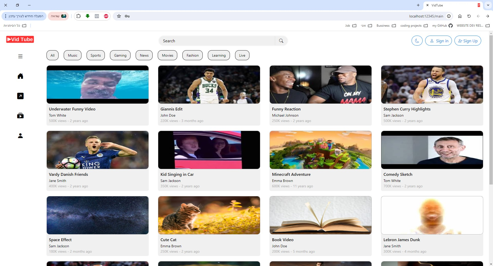
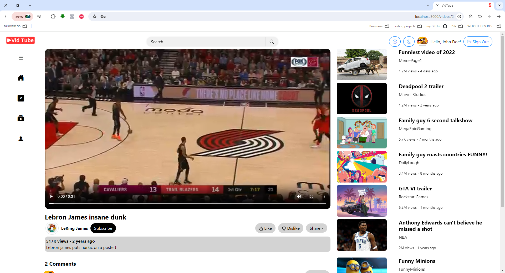
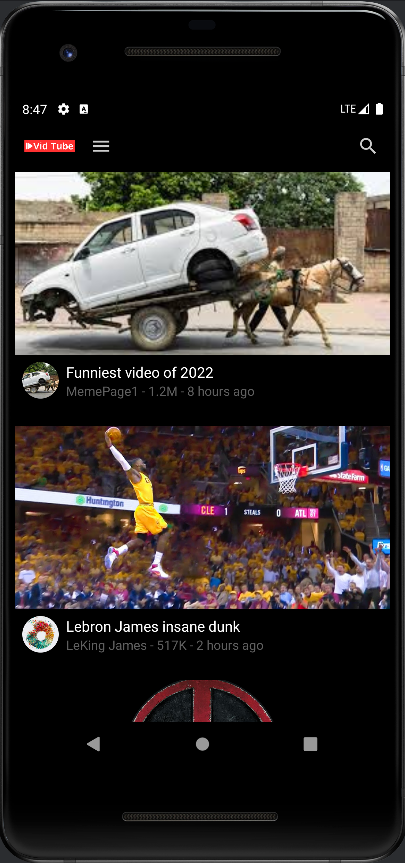
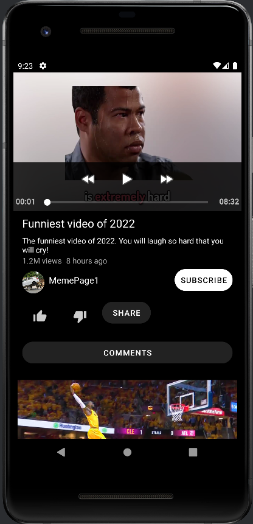
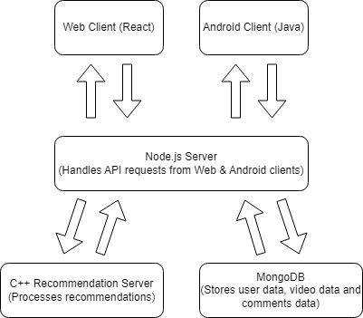

# VidTube 

VidTube is a full-stack video-sharing platform with both web and Android clients, powered by a Node.js server and a C++ recommendation algorithm. The project is built across four interconnected **[repositories](#repositories)**, each serving a unique function in the system architecture.

## Project Overview

This project is designed to provide a seamless video-streaming experience with recommendations based on a custom algorithm. The system integrates multiple components to serve both web and Android platforms.

## Screenshots
### Web app:

### Android app:

## Repositories

The project is split into four main repositories, each handling a different part of the system:

1. **[Web Client Side](https://github.com/maxshabs/project_web/tree/master-part4)**: 
   - Built with React.
   - Provides a user-friendly interface for video browsing, watching, and uploading.

2. **[Android Client Side](https://github.com/eyalg43/project_android/tree/mainPart4)**: 
   - Developed in Java for Android devices.
   - Delivers a native mobile experience for VidTube, with features like video playback, user authentication, and video uploads.

3. **[Node.js Server (Web & Android)](https://github.com/OCDev1/VidTube-server/tree/main-part4)**: 
   - Powers the backend for both web and Android clients.
   - Handles user management, video uploads, API routing, and serves video data to the clients.

4. **[C++ Recommendation Algorithm Server](https://github.com/maxshabs/vidtube-part4.git)**:
   - A multithreaded C++ server that processes user data to generate personalized video recommendations.
   - Communicates with the Node.js server to suggest videos based on user preferences and popular content.

In addition, all the project files are in this repository as well:

- **[Web App](./Web-App)**
- **[Android App](./Android-App)**
- **[Node.js Server](./Node-js-Server)**
- **[Recommendation Algorithm Server](./Recommendation-Algorithm-Server)**

## Architecture

The system is designed with a **client-server architecture**, where the web and Android clients interact with the Node.js backend. The C++ server is responsible for providing video recommendations, and it communicates with the Node.js server to retrieve and update data.

## Technologies Used

- **Frontend (Web)**: React, CSS, JavaScript
- **Frontend (Android)**: Java, XML
- **Backend (Server)**: Node.js, Express, MongoDB
- **Recommendation Algorithm**: C++ (multithreaded)

## Features

- **Responsive Web Interface**: Fully responsive web client built with React.
- **Native Android Application**: Android client for mobile users, featuring smooth video playback and user-friendly interactions.
- **Node.js API**: Backend API that handles data persistence, user management, and video handling for both web and Android.
- **Recommendation Algorithm**: A custom C++ algorithm to provide personalized video recommendations based on watch history and popular trends.

## RESTful API

The Node.js server in the VidTube project provides a RESTful API to handle various actions like video uploads, user management, likes, dislikes, and retrieving data for the web and Android clients. The API follows standard REST principles, using different HTTP methods to interact with resources. This API supports key operations like managing users, videos, comments, likes, and dislikes, all while adhering to RESTful principles.
